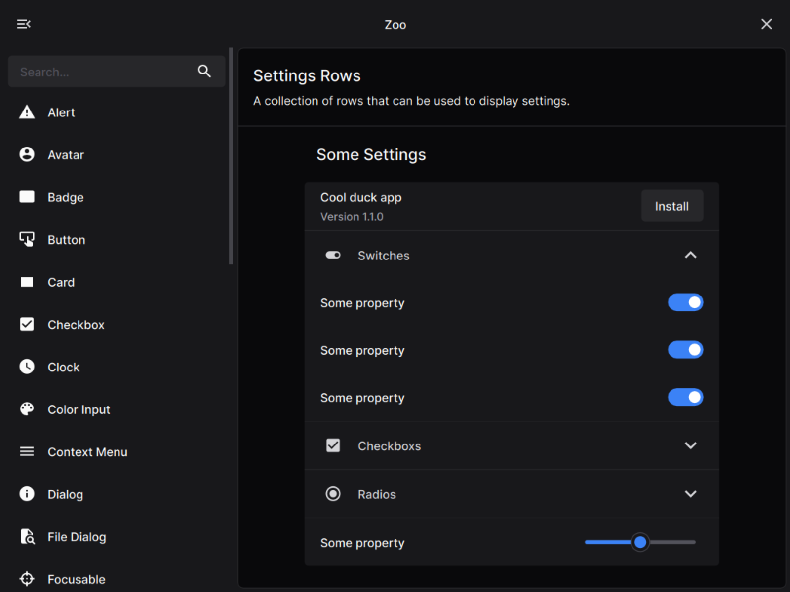

 
 

A batteries included framework for modern cross-platform C++ applications

 

 
 

## Getting Started

Follow the [Getting Started Guide](doc/getting-started.md) to set up your first Karm project and run a simple "Hello
World" application.

## Sponsors

JetBrains provides IDE licenses used for development of this project.

## License

The karm framework is licensed under the **GNU Lesser General Public License v3.0 or later**.

The full text of the license can be accessed via [this link](https://www.gnu.org/licenses/lgpl-3.0-standalone.html) and
is also included in the [license.txt](license.txt) file of this software package.
